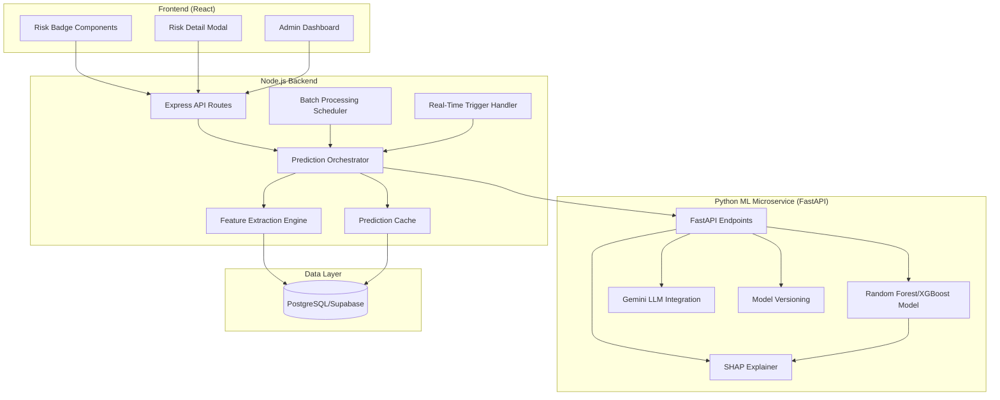

# Design Document: Smart Automated Dropout Prediction System

## Overview

The Smart Automated Dropout Prediction System is a microservices-based ML solution that provides early warning indicators for student dropout risk. The system architecture separates concerns between data engineering (Node.js backend) and machine learning inference (Python FastAPI microservice), enabling independent scaling and evolution of each component.

### Key Design Principles

1. **Microservices Separation**: Node.js handles all database operations, feature extraction, and API orchestration. Python FastAPI handles ML inference, SHAP explanations, and LLM-powered recommendations. This separation ensures the ML service remains stateless and focused solely on prediction logic.

2. **Data-Driven Reliability**: The Data Tier system (0-3) prevents predictions on insufficient data, ensuring educators receive reliable risk assessments. Tier 0 (insufficient data) blocks predictions entirely, while Tiers 1-3 provide increasing confidence levels.

3. **Dual Processing Modes**: Automated batch processing (nightly at 2 AM, deep analysis Sundays at 11 PM) maintains current risk assessments for all students, while real-time triggers (high-severity behavior incidents, 3+ consecutive absences) enable immediate intervention for critical events.

4. **Explainable AI**: SHAP (SHapley Additive exPlanations) values provide feature-level attribution for every prediction, enabling teachers to understand why a student received a specific risk score and target interventions effectively.

5. **Isolated Development**: All new code resides in isolated directories (/ml-service/, /backend/ml-integration/, /src/components/risk/) to avoid merge conflicts during Phase 1 development.

### System Context

The dropout prediction system integrates with the existing education platform's data layer:
- **Attendance data**: Daily/subject-level attendance records with present/absent/late status
- **Academic data**: Exam scores with finalized status (submitted/verified)
- **Behavior data**: Incident records with severity levels (low/medium/high/critical)
- **Intervention data**: Historical intervention records with outcomes

The system produces risk scores (0-100), risk levels (low/medium/high/critical), SHAP explanations, and LLM-generated recommendations that surface through UI components (risk badges, detailed modals) and teacher notifications.

## Architecture

### High-Level Architecture



### Component Responsibilities

**Node.js Backend (`/backend/ml-integration/`)**:
- Feature extraction from PostgreSQL/Supabase
- Data tier calculation and validation
- Prediction orchestration and caching
- Batch processing scheduling (node-cron)
- Real-time trigger handling
- Teacher notification dispatch
- API rate limiting and authentication

**Python ML Microservice (`/ml-service/`)**:
- Risk score prediction (Random Forest/XGBoost)
- SHAP value calculation for explainability
- LLM-powered recommendation generation (Google Gemini)
- Model retraining pipeline
- Model versioning and performance tracking
- Health check and metrics endpoints

**Frontend Components (`/src/components/risk/`)**:
- RiskBadge: Color-coded visual indicators
- RiskDetailModal: Comprehensive risk breakdown
- AdminDashboard: School-wide risk analytics
- DataTierIndicator: Confidence visualization

### Technology Stack

**Node.js Backend**:
- Express.js for REST API
- `pg` driver for raw SQL with parameterized queries (no ORM)
- `node-cron` for batch scheduling
- `node-cache` for in-memory prediction caching
- `winston` for structured logging

**Python ML Microservice**:
- FastAPI for high-performance API
- scikit-learn or XGBoost for ML model
- SHAP library for explainability
- Google Generative AI SDK for LLM recommendations
- joblib for model serialization
- pydantic for request/response validation

**Frontend**:
- React components with Tailwind CSS
- Recharts for risk trend visualization
- React Query for API state management

### Communication Patterns

1. **Synchronous HTTP**: Frontend → Node.js API → Python ML Service
2. **Scheduled Jobs**: node-cron triggers batch processing
3. **Event-Driven Triggers**: Database triggers/webhooks → Real-time prediction
4. **Caching Layer**: 6-hour TTL for prediction results to reduce ML service load

## Components and Interfaces

### Node.js Backend Components

#### 1. Feature Extraction Engine (`/backend/ml-integration/featureExtractor.js`)

**Purpose**: Extract and calculate ML features from raw database records.

**Key Functions**:

```javascript
async function extractFeatures(studentId, pool)
```
- Queries attendance, marks, behavior, interventions tables
- Calculates 15+ features across 4 categories
- Returns feature vector with NULL handling
- Throws error if database query fails

```javascript
async function calculateDataTier(studentId, pool)
```
- Counts marked attendance days (excluding NULL records)
- Counts finalized exams (status = 'submitted' OR 'verified')
- Returns tier 0-3 based on thresholds
- Returns 0 if insufficient data

**Feature Categories**:

1. **Attendance Features** (35% weight):
   - `attendance_rate`: (present + late) / marked_days
   - `attendance_trend`: recent_30_day_rate - previous_30_day_rate
   - `consecutive_absences`: max streak of absent days
   - `late_arrival_frequency`: late_count / marked_days
   - `marked_days_count`: total days with attendance record

2. **Academic Features** (40% weight):
   - `average_score`: mean of finalized exam marks (excluding NULL)
   - `academic_trend`: recent_3_exam_avg - previous_3_exam_avg
   - `failing_subject_count`: subjects with avg < passing_threshold
   - `score_variance`: standard deviation of exam scores
   - `finalized_exam_count`: count of submitted/verified exams

3. **Behavior Features** (15% weight):
   - `behavior_score`: 100 - (minor*5 + moderate*15 + high*30 + critical*50)
   - `behavior_trend`: recent_30_day_incidents - previous_30_day_incidents
   - `days_since_last_incident`: current_date - most_recent_incident_date
   - `high_severity_incident_count`: count of high/critical incidents

4. **Intervention Features** (10% weight):
   - `total_intervention_count`: all interventions for student
   - `intervention_success_rate`: successful / total
   - `days_since_last_intervention`: current_date - most_recent_intervention_date
   - `active_intervention_count`: interventions with status 'in_progress'

**Data Tier Calculation Logic**:
```
Tier 0: marked_days < 14 OR finalized_exams < 1
Tier 1: marked_days >= 14 AND < 30 AND finalized_exams >= 1 AND < 3
Tier 2: marked_days >= 30 AND < 60 AND finalized_exams >= 3 AND < 5
Tier 3: marked_days >= 60 AND finalized_exams >= 5
```

#### 2. Prediction Orchestrator (`/backend/ml-integration/predictionOrchestrator.js`)

**Purpose**: Coordinate prediction workflow between feature extraction, caching, and ML service.

**Key Functions**:

```javascript
async function getPrediction(studentId, options = {})
```
- Checks cache for recent prediction (< 6 hours)
- Calculates data tier
- Returns early if tier 0 (insufficient data)
- Extracts features if tier >= 1
- Calls ML service with retry logic (3 attempts, exponential backoff)
- Stores prediction in database and cache
- Returns prediction object with risk_score, risk_level, shap_values, recommendations

```javascript
async function invalidateCache(studentId)
```
- Removes cached prediction for student
- Called when new attendance/marks/behavior data is recorded

**Retry Logic**:
- Initial delay: 1 second
- Exponential backoff: delay *= 2
- Max retries: 3
- Fallback: Return cached prediction with `stale_data: true` flag

#### 3. Batch Processor (`/backend/ml-integration/batchProcessor.js`)

**Purpose**: Execute scheduled batch predictions for all active students.

**Key Functions**:

```javascript
async function runDailyBatch()
```
- Scheduled: 2:00 AM daily
- Queries all active students with tier >= 1
- Processes predictions in parallel (batch size: 50)
- Logs errors but continues processing
- Sends summary notification to admins

```javascript
async function runWeeklyDeepAnalysis()
```
- Scheduled: 11:00 PM every Sunday
- Includes trend analysis and historical comparison
- Generates weekly risk reports
- Identifies students with significant risk changes

**Scheduling Configuration**:
```javascript
// Daily batch: 2:00 AM
cron.schedule('0 2 * * *', runDailyBatch);

// Weekly deep analysis: 11:00 PM Sunday
cron.schedule('0 23 * * 0', runWeeklyDeepAnalysis);
```

#### 4. Real-Time Trigger Handler (`/backend/ml-integration/triggerHandler.js`)

**Purpose**: Handle immediate prediction requests triggered by critical events.

**Key Functions**:

```javascript
async function handleBehaviorTrigger(studentId, severity)
```
- Triggered when behavior incident with severity 'high' or 'critical' is recorded
- Invalidates cache
- Requests immediate prediction
- Sends notification to assigned teachers if risk increases >= 15 points

```javascript
async function handleAbsenceTrigger(studentId)
```
- Triggered when student has 3 consecutive absences
- Checks data tier before prediction
- Sends immediate notification to teachers

**Integration Points**:
- Called from existing attendance/behavior controllers
- Uses database triggers or application-level hooks
- Queues requests to avoid overwhelming ML service

### Python ML Microservice Components

#### 1. Prediction API (`/ml-service/app/api/predict.py`)

**Purpose**: FastAPI endpoints for risk prediction and model management.

**Endpoints**:

```python
POST /api/v1/predict
```
- Request body: `{ "student_id": str, "features": dict }`
- Response: `{ "risk_score": float, "risk_level": str, "confidence": float, "model_version": str }`
- Validates feature vector (15+ features)
- Handles NULL values with imputation
- Returns prediction within 2 seconds (95th percentile)

```python
POST /api/v1/explain
```
- Request body: `{ "student_id": str, "features": dict }`
- Response: `{ "shap_values": list, "top_features": list }`
- Calculates SHAP values for all features
- Returns top 5 features by absolute SHAP value
- Formats explanations as human-readable text

```python
POST /api/v1/recommend
```
- Request body: `{ "student_id": str, "risk_score": float, "shap_values": list, "context": dict }`
- Response: `{ "recommendations": list }`
- Only generates recommendations if risk_score >= 50
- Calls Google Gemini LLM with SHAP explanations and context
- Returns 3-5 actionable recommendations with effort estimates
- Fallback to rule-based recommendations if LLM fails

```python
POST /api/v1/retrain (admin-only)
```
- Request body: `{ "training_data": list }`
- Response: `{ "model_version": str, "metrics": dict, "status": str }`
- Trains new model with 5-fold cross-validation
- Calculates accuracy, precision, recall, F1-score, AUC-ROC
- Replaces active model if F1-score improves by >= 2%
- Versions model with timestamp and metrics

```python
GET /api/v1/health
```
- Response: `{ "status": str, "model_version": str, "response_time_ms": float }`
- Health check for monitoring

#### 2. ML Model (`/ml-service/app/models/risk_model.py`)

**Purpose**: Risk prediction using Random Forest or XGBoost.

**Model Architecture**:
- Algorithm: Random Forest (primary) or XGBoost (alternative)
- Input: 15+ features (attendance, academic, behavior, intervention)
- Output: Risk score (0-100) and risk level (low/medium/high/critical)
- Feature weights: 35% attendance, 40% academic, 15% behavior, 10% intervention

**Training Configuration**:
```python
RandomForestClassifier(
    n_estimators=200,
    max_depth=15,
    min_samples_split=10,
    min_samples_leaf=5,
    class_weight='balanced',
    random_state=42
)
```

**Feature Imputation Strategy**:
- `attendance_rate`: Impute with class average
- `average_score`: Impute with class average
- `behavior_score`: Impute with 100 (no incidents)
- `intervention_success_rate`: Impute with NULL (exclude from calculation)
- `days_since_last_incident`: Impute with enrollment_duration_days

**Risk Level Classification**:
```python
if risk_score < 25: return "low"
elif risk_score < 50: return "medium"
elif risk_score < 75: return "high"
else: return "critical"
```

#### 3. SHAP Explainer (`/ml-service/app/explainability/shap_explainer.py`)

**Purpose**: Generate feature-level explanations for predictions.

**Key Functions**:

```python
def calculate_shap_values(model, feature_vector)
```
- Uses TreeExplainer for tree-based models
- Returns SHAP value for each feature
- Indicates positive (increases risk) or negative (decreases risk) contribution

```python
def get_top_features(shap_values, feature_names, n=5)
```
- Sorts features by absolute SHAP value
- Returns top N features with highest impact
- Includes feature name, SHAP value, actual value, direction

```python
def format_explanation(feature_name, shap_value, actual_value)
```
- Converts SHAP values to human-readable text
- Example: "Low attendance rate (65%) increases risk by 18 points"
- Example: "High behavior score (95) decreases risk by 12 points"

#### 4. LLM Recommendation Engine (`/ml-service/app/recommendations/llm_recommender.py`)

**Purpose**: Generate personalized intervention recommendations using Google Gemini.

**Key Functions**:

```python
async def generate_recommendations(risk_score, shap_values, student_context)
```
- Only called if risk_score >= 50
- Constructs prompt with SHAP explanations and context
- Calls Google Gemini API (gemini-1.5-flash)
- Parses 3-5 specific, actionable recommendations
- Estimates intervention effort (low/medium/high)

**Prompt Template**:
```
You are an educational intervention specialist. A student has a dropout risk score of {risk_score}/100.

Top risk factors:
{shap_explanations}

Student context:
- Grade: {grade}
- Current attendance rate: {attendance_rate}%
- Average score: {average_score}
- Recent behavior incidents: {behavior_count}

Generate 3-5 specific, actionable intervention recommendations prioritized by impact. For each recommendation, include:
1. Specific action to take
2. Expected impact on risk factors
3. Estimated effort (low/medium/high)
4. Timeline for implementation
```

**Fallback Rule-Based Recommendations**:
If LLM API fails, return recommendations based on top SHAP features:
- Low attendance → "Schedule parent meeting to discuss attendance barriers"
- Low academic performance → "Arrange peer tutoring for struggling subjects"
- High behavior incidents → "Implement behavior intervention plan with counselor"
- No interventions → "Initiate check-in meetings with student"

### Frontend Components

#### 1. RiskBadge Component (`/src/components/risk/RiskBadge.jsx`)

**Purpose**: Visual risk indicator for student lists.

**Props**:
```javascript
{
  studentId: string,
  riskScore: number,
  riskLevel: string,
  dataTier: number,
  lastUpdated: string,
  onClick: function
}
```

**Visual Design**:
- Low (0-25): Green badge with "✓" icon
- Medium (25-50): Yellow badge with "⚠" icon
- High (50-75): Orange badge with "⚠" icon
- Critical (75-100): Red badge with "!" icon
- Tier 0: Gray badge with "⏳ Gathering Data"
- Tier 1: Warning icon "⚠️" overlay

**Hover Behavior**:
- Shows risk score percentage
- Shows last updated timestamp
- Shows data tier confidence indicator

**Click Behavior**:
- Opens RiskDetailModal with full breakdown

#### 2. RiskDetailModal Component (`/src/components/risk/RiskDetailModal.jsx`)

**Purpose**: Comprehensive risk breakdown view.

**Sections**:

1. **Risk Summary**:
   - Risk score (0-100) with color-coded progress bar
   - Risk level badge
   - Data tier with confidence indicator
   - Last updated timestamp

2. **SHAP Explanations**:
   - Top 5 features with horizontal bars showing contribution magnitude
   - Feature name, actual value, SHAP value, direction (↑ increases / ↓ decreases)
   - Color-coded: red for risk-increasing, green for risk-decreasing

3. **Trend Indicators**:
   - Attendance trend: ↑ improving / ↓ declining / → stable
   - Academic trend: ↑ improving / ↓ declining / → stable
   - Behavior trend: ↑ improving / ↓ declining / → stable

4. **LLM Recommendations**:
   - 3-5 actionable recommendations
   - Effort estimate badge (low/medium/high)
   - Priority ordering based on SHAP values

5. **Historical Risk Chart**:
   - Line chart showing risk score over past 90 days
   - Marks significant events (behavior incidents, intervention starts)

6. **Data Completeness**:
   - Marked days count with progress bar
   - Finalized exam count with progress bar
   - Behavior incident count

#### 3. AdminDashboard Component (`/src/components/risk/AdminDashboard.jsx`)

**Purpose**: School-wide risk analytics and monitoring.

**Sections**:

1. **Risk Distribution**:
   - Pie chart: student count by risk level
   - Total students analyzed
   - Percentage in each category

2. **Trend Chart**:
   - Line chart: at-risk student count over past 6 months
   - Separate lines for high and critical risk levels

3. **High-Risk Students List**:
   - Top 10 highest-risk students
   - Student name, risk score, assigned teacher
   - Quick link to detailed modal

4. **Grade-Level Analysis**:
   - Bar chart: average risk score by grade
   - Identifies grades needing attention

5. **Model Performance**:
   - Last training date
   - Accuracy, F1-score, AUC-ROC
   - "Trigger Retraining" button (admin-only)

6. **Batch Processing Status**:
   - Last run time
   - Next scheduled run
   - Students analyzed in last batch
   - Error count

## Data Models

### Database Schema Extensions

#### Predictions Table

```sql
CREATE TABLE IF NOT EXISTS ml_predictions (
    id TEXT PRIMARY KEY,
    student_id TEXT NOT NULL REFERENCES students(id) ON DELETE CASCADE,
    risk_score DECIMAL(5,2) NOT NULL CHECK (risk_score >= 0 AND risk_score <= 100),
    risk_level VARCHAR(20) NOT NULL CHECK (risk_level IN ('low', 'medium', 'high', 'critical')),
    data_tier INTEGER NOT NULL CHECK (data_tier >= 0 AND data_tier <= 3),
    confidence DECIMAL(5,2),
    model_version VARCHAR(50) NOT NULL,
    shap_values JSONB,
    feature_vector JSONB NOT NULL,
    prediction_type VARCHAR(20) NOT NULL CHECK (prediction_type IN ('batch', 'realtime')),
    created_at TIMESTAMP DEFAULT CURRENT_TIMESTAMP,
    created_by TEXT REFERENCES users(id)
);

CREATE INDEX idx_ml_predictions_student_id ON ml_predictions(student_id);
CREATE INDEX idx_ml_predictions_risk_level ON ml_predictions(risk_level);
CREATE INDEX idx_ml_predictions_created_at ON ml_predictions(created_at);
```

#### Recommendations Table

```sql
CREATE TABLE IF NOT EXISTS ml_recommendations (
    id TEXT PRIMARY KEY,
    prediction_id TEXT NOT NULL REFERENCES ml_predictions(id) ON DELETE CASCADE,
    student_id TEXT NOT NULL REFERENCES students(id) ON DELETE CASCADE,
    recommendation_text TEXT NOT NULL,
    priority INTEGER NOT NULL,
    effort_level VARCHAR(20) CHECK (effort_level IN ('low', 'medium', 'high')),
    status VARCHAR(20) DEFAULT 'pending' CHECK (status IN ('pending', 'in_progress', 'completed', 'dismissed')),
    assigned_to TEXT REFERENCES users(id),
    created_at TIMESTAMP DEFAULT CURRENT_TIMESTAMP,
    completed_at TIMESTAMP
);

CREATE INDEX idx_ml_recommendations_prediction_id ON ml_recommendations(prediction_id);
CREATE INDEX idx_ml_recommendations_student_id ON ml_recommendations(student_id);
CREATE INDEX idx_ml_recommendations_status ON ml_recommendations(status);
```

#### Model Versions Table

```sql
CREATE TABLE IF NOT EXISTS ml_model_versions (
    id TEXT PRIMARY KEY,
    version VARCHAR(50) UNIQUE NOT NULL,
    algorithm VARCHAR(50) NOT NULL,
    hyperparameters JSONB,
    training_date TIMESTAMP NOT NULL,
    training_samples INTEGER NOT NULL,
    accuracy DECIMAL(5,4),
    precision_score DECIMAL(5,4),
    recall DECIMAL(5,4),
    f1_score DECIMAL(5,4),
    auc_roc DECIMAL(5,4),
    is_active BOOLEAN DEFAULT FALSE,
    model_file_path TEXT,
    created_at TIMESTAMP DEFAULT CURRENT_TIMESTAMP
);

CREATE INDEX idx_ml_model_versions_is_active ON ml_model_versions(is_active);
CREATE INDEX idx_ml_model_versions_training_date ON ml_model_versions(training_date);
```

#### Prediction Logs Table

```sql
CREATE TABLE IF NOT EXISTS ml_prediction_logs (
    id TEXT PRIMARY KEY,
    student_id TEXT NOT NULL REFERENCES students(id) ON DELETE CASCADE,
    request_type VARCHAR(20) NOT NULL CHECK (request_type IN ('batch', 'realtime', 'manual')),
    data_tier INTEGER NOT NULL,
    success BOOLEAN NOT NULL,
    error_message TEXT,
    response_time_ms INTEGER,
    cache_hit BOOLEAN DEFAULT FALSE,
    created_at TIMESTAMP DEFAULT CURRENT_TIMESTAMP
);

CREATE INDEX idx_ml_prediction_logs_student_id ON ml_prediction_logs(student_id);
CREATE INDEX idx_ml_prediction_logs_created_at ON ml_prediction_logs(created_at);
CREATE INDEX idx_ml_prediction_logs_success ON ml_prediction_logs(success);
```

### API Request/Response Models

#### Prediction Request (Node.js → Python)

```javascript
{
  "student_id": "string",
  "features": {
    // Attendance features
    "attendance_rate": 0.85,
    "attendance_trend": -0.05,
    "consecutive_absences": 2,
    "late_arrival_frequency": 0.10,
    "marked_days_count": 45,
    
    // Academic features
    "average_score": 72.5,
    "academic_trend": -5.2,
    "failing_subject_count": 1,
    "score_variance": 12.3,
    "finalized_exam_count": 4,
    
    // Behavior features
    "behavior_score": 85,
    "behavior_trend": 2,
    "days_since_last_incident": 15,
    "high_severity_incident_count": 1,
    
    // Intervention features
    "total_intervention_count": 2,
    "intervention_success_rate": 0.5,
    "days_since_last_intervention": 30,
    "active_intervention_count": 0
  },
  "data_tier": 2,
  "context": {
    "grade": 10,
    "enrollment_duration_days": 180
  }
}
```

#### Prediction Response (Python → Node.js)

```javascript
{
  "student_id": "string",
  "risk_score": 68.5,
  "risk_level": "high",
  "confidence": 0.82,
  "model_version": "v1.2.3",
  "shap_values": [
    {
      "feature_name": "attendance_rate",
      "shap_value": 18.2,
      "actual_value": 0.85,
      "direction": "increases",
      "explanation": "Low attendance rate (85%) increases risk by 18 points"
    },
    {
      "feature_name": "academic_trend",
      "shap_value": 12.5,
      "actual_value": -5.2,
      "direction": "increases",
      "explanation": "Declining academic performance (-5.2 points) increases risk by 13 points"
    }
    // ... top 5 features
  ],
  "recommendations": [
    {
      "text": "Schedule weekly check-ins with student to discuss attendance barriers and provide support",
      "priority": 1,
      "effort_level": "medium",
      "expected_impact": "Improve attendance rate by 10-15%"
    }
    // ... 3-5 recommendations
  ],
  "prediction_timestamp": "2024-01-15T10:30:00Z"
}
```

### Feature Vector Schema

```javascript
{
  // Required features (15 minimum)
  "attendance_rate": float | null,          // 0.0 - 1.0
  "attendance_trend": float | null,         // -1.0 to 1.0
  "consecutive_absences": int,              // >= 0
  "late_arrival_frequency": float | null,   // 0.0 - 1.0
  "marked_days_count": int,                 // >= 0
  
  "average_score": float | null,            // 0.0 - 100.0
  "academic_trend": float | null,           // -100.0 to 100.0
  "failing_subject_count": int,             // >= 0
  "score_variance": float | null,           // >= 0
  "finalized_exam_count": int,              // >= 0
  
  "behavior_score": float,                  // 0.0 - 100.0
  "behavior_trend": int,                    // negative = improving
  "days_since_last_incident": int | null,   // >= 0
  "high_severity_incident_count": int,      // >= 0
  
  "total_intervention_count": int,          // >= 0
  "intervention_success_rate": float | null, // 0.0 - 1.0
  "days_since_last_intervention": int | null, // >= 0
  "active_intervention_count": int          // >= 0
}
```

